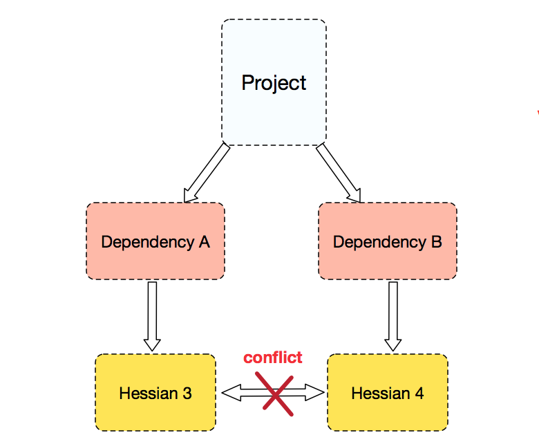
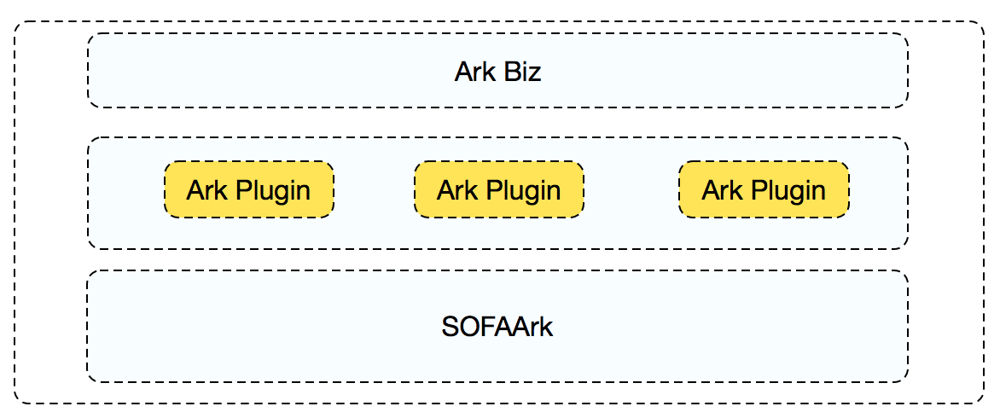

SOFABoot 是蚂蚁金服中间件团队开源的基于 Spring Boot 的一个开发框架，其在 Spring Boot 基础能力之上，增加了类隔离能力。蚂蚁金服内部丰富的实践场景表明，类隔离能力对解决类冲突、版本管控有其特殊的优势。

SOFABoot 的类隔离能力由单独的组件 SOFAArk 实现，相比业界遵循 OSGi（[https://www.osgi.org/](https://www.osgi.org/)） 规范的 Equinox 或者 Felix，<span data-type="color" style="color:rgb(38, 38, 38)"><span data-type="background" style="background-color:rgb(255, 255, 255)">SOFAArk 专注于类隔离，简化了类加载模型，</span></span>是一款更加轻量的类隔离框架。

本文将介绍 SOFABoot 类隔离能力的背景及其使用方式。

# 1. 背景

在 Java 世界中，依赖的 JAR 包之间相互冲突永远是一个痛，Spring Boot 采用统一的依赖管理机制规避了大部分依赖冲突问题。理想很美好，现实却很骨感，作为蚂蚁金服这类大体量的公司，各业务线纷繁复杂、基础服务组件繁多，很难做到对所有 JAR 包做统一管控，尤其涉及到多个跨团队模块组件相互依赖时，因为各自技术栈历史包袱的存在，难以有效统一冲突包版本。

假设如下场景，工程需要引入两个三方组件：A 和 B，组件 A 需要依赖 Hessian 3，组件 B 需要依赖 Hessian 4，因为 Hessian 3 和 Hessian 4 是不兼容的。作为开发者，遇到这种包冲突问题，如果不借助类隔离框架，只能耗费精力升级到统一版本。





为了彻底解决类似的包冲突问题，我们需要借助类隔离机制，使用不同的类加载器加载冲突的三方依赖包，进而做到在同一个应用运行时共存。

基于此背景，SOFABoot 提供了一个轻量级的类隔离框架，也是本文的主角，SOFAArk。

# 2. 基本原理

在介绍 SOFAArk 类隔离框架使用之前，我们简单了解下其背后的实现原理。正如前文中描述，SOFAArk 是通过独立的类加载器加载相互冲突的三方依赖包，从而做到隔离包冲突。那么我们不禁要问，SOFAArk 是如何区分应用中哪些依赖包是需要单独的类加载器加载呢？原因是 Ark Plugin，它是 SOFAArk 框架定义的一种特殊的 JAR 包文件格式，<span data-type="color" style="color:rgb(38, 38, 38)"><span data-type="background" style="background-color:rgb(255, 255, 255)">SOFAArk 框架会自动识别 Ark Plugin 这种特殊依赖</span></span>。

何为 Ark Plugin ? Ark Plugin 本质上是一个 FatJar，借助 SOFABoot 官方提供的 maven 打包插件，开发者可以把若干普通的 JAR 包打包成 Ark Plugin 供应用依赖或者把普通的 Java 模块改造成 Ark Plugin。通常来说，如果把一个普通 JAR 打包成 Ark Plugin，那么该 JAR 包依赖的其他三方包也会被打入同一个 Ark Plugin，默认情况下 SOFABoot 官方打包插件会自动把间接依赖也打入到 Ark Plugin。

应用使用添加 maven 依赖的方式引入 Ark Plugin，运行时，SOFAArk 框架会自动识别应用的三方依赖包中是否含有 Ark Plugin，进而使用单独的类加载器加载。为了更加直观，下图是应用运行时逻辑分层图：





可以看到，在应用运行时，SOFAArk 容器处于最底层，负责启动应用。应用依赖的所有 Ark Plugin 处于中间层，每个 Ark Plugin 都由 SOFAArk 容器使用独立的类加载器加载，相互隔离。应用业务代码及其他非 Ark Plugin 的普通三方依赖包，为了描述简单，统称为 Ark Biz，它运行在最上层，需要依赖中间层的 Ark Plugin。

一个标准 Ark Plugin 会包含一些配置文件，主要包含导出类和导入类配置。导出类即把 Ark Plugin 中的类导出给 Ark Biz 和其他 Ark Plugin 可见。默认情况下，所有 Ark Plugin 的导出类对于 Ark Biz 来说都是可见的，即 Ark Biz 可以使用 Ark Plugin 的导出类。对于 Ark Plugin 来说，如果需要使用其他 Ark Plugin 的导出类，必须声明为自身的导入类。关于 Ark Plugin 详细说明可以参考文末相关链接。

下面我们来演示如何开发一个简单的 Ark Plugin。

# 3. Java 模块改造成 Ark Plugin 
## 3.1 新建工程

Demo 工程参见：[https://github.com/QilongZhang/ark-plugin-demo](https://github.com/QilongZhang/ark-plugin-demo)

运行需要 JDK 6 及以上、 Maven 3.2.5 以上。

首先我们在 IDE 里新建一个普通 Maven 工程，并创建三个普通的 Java 模块。以前文描述的 Hessian 冲突为例，在演示工程中定义了三个模快：

* pojo-module: 定义了一个简单的 PoJo 类 SamplePoJo，并设置为导出类，打包成 `pojo-ark-plugin` 。
* hessian3-module：定义了一个服务类 Hessian3Service，实现了简单的序列化和反序列逻辑，使用的版本是 Hessian 3，并导入了 SamplePoJo，打包成 `hessian3-ark-plugin` 。
* hessian4-module：定义了一个服务类 Hessian4Service，和 Hessian3Service 功能类似，使用的版本是 Hessian 4，并导入了 SamplePoJo，打包成 `hessian4-ark-plugin` 。

该用例是为了演示如何将普通的 Java 模块及其三方依赖包打包成 Ark Plugin，以 `hessian3-module` 模块为例来讲解打包流程。

## 3.2 编写服务类

在 `hessian3-module` 中，提供了一个简单的序列化和反序列化功能类 Hessian3Service：

```java
package com.alipay.sofa.demo.hessian3;

import com.caucho.hessian.io.HessianInput;
import com.caucho.hessian.io.HessianOutput;

import java.io.ByteArrayInputStream;
import java.io.ByteArrayOutputStream;
import java.io.IOException;

/**
 * @author qilong.zql
 */
public class Hessian3Service {
    public byte[] serialize(Object obj) throws IOException {
        if(obj==null) throw new NullPointerException();

        ByteArrayOutputStream os = new ByteArrayOutputStream();
        HessianOutput ho = new HessianOutput(os);
        ho.writeObject(obj);
        return os.toByteArray();
    }

    public Object deserialize(byte[] by) throws IOException {
        if(by==null) throw new NullPointerException();

        ByteArrayInputStream is = new ByteArrayInputStream(by);
        HessianInput hi = new HessianInput(is);
        return hi.readObject();
    }
}
```

该功能类非常简单，提供了两个方法调用，分别实现对象的序列化和发序列化。

## 3.3 Ark Plugin 配置

因为 Ark Plugin 的配置大同小异，在这里以普通的 Java 模块 `hessian3-module` 打包成 `hessian3-ark-plugin` 为例，介绍 Ark Plugin 的一般配置。

首先，我们需要添加 SOFABoot 官方提供的 maven 打包插件：

```xml
<plugin>
    <groupId>com.alipay.sofa</groupId>
    <artifactId>sofa-ark-plugin-maven-plugin</artifactId>
    <version>0.2.0<version>
</plugin>
```

然后在`hessian3-module` 演示用例中，只需要在模块 `pom.xml` 文件中添加一个导出类和一个导入类配置，配置如下：

```xml
<build>
    <plugins>
        <plugin>
            <groupId>com.alipay.sofa</groupId>
            <artifactId>sofa-ark-plugin-maven-plugin</artifactId>
            <version>0.2.0</version>
            <executions>
                <execution>
                    <id>default-cli</id>
                    <goals>
                        <goal>ark-plugin</goal>
                    </goals>

                    <configuration>
                        <!-- configure imported class -->
                        <imported>
                            <!-- configure class-level imported class -->
                            <classes>
                                <class>com.alipay.sofa.demo.pojo.SamplePoJo</class>
                            </classes>
                        </imported>

                        <!-- configure exported class -->
                        <exported>
                            <!-- configure class-level exported class -->
                            <classes>
                                <class>com.alipay.sofa.demo.hessian3.Hessian3Service</class>
                            </classes>
                        </exported>
                    </configuration>
                </execution>
            </executions>
        </plugin>
    </plugins>
</build>
```

可以看到，`hessian3-ark-plugin` 导入了基础实体类 `com.alipay.sofa.demo.pojo.SamplePoJo`，导出服务类 `com.alipay.sofa.demo.hessian3.Hessian3Service` 供 Ark Biz 使用。

使用 maven 打包命令 `maven package` 即可将 `hessian3-module` 打包成 Ark Plugin，该插件包含模块代码及其依赖包，其 maven 坐标为：

```xml
<dependency>
    <groupId>com.alipay.sofa</groupId>
    <artifactId>hessian3-ark-plugin</artifactId>
    <classifier>ark-plugin</classifier>
    <version>1.0.0</version>
</dependency>
```

关于 Ark Plugin 的导入、导出类，这里强调一下，在实际开发中，和业务本身无关的实体类或者基础服务类，如果多个 Ark Plugin 和 Ark Biz 都需要统一版本时，可以把这类基础 Jar 统一打包成 Ark Plugin 设置为导出类。在该演示用例中，我们假设 `SamplePoJo` 是一个基础实体类，和业务逻辑无关，而 `hessian3-ark-plugin` 和 `hessian4-ark-plugin` 都需要使用，于是单独打包成了一个 Ark Plugin。

到此为止，这就是一个简单的 Ark Plugin 从开发的步骤，看起来是不是很简单呢？

下面，我们演示下如何在 Spring Boot 工程中，快速集成 SOFABoot 的类隔离能力，并使用这三个 Ark Plugin。

# 4. Spring Boot 工程集成 SOFAArk 组件

Demo 工程参见：[https://github.com/QilongZhang/springboot-ark-demo](https://github.com/QilongZhang/springboot-ark-demo)

运行需要 JDK 6 及以上、 Maven 3.2.5 以上。Spring Boot 版本要求 1.4.2.RELEASE 以上，目前还不兼容 2.0.0 及以上版本。

该用例工程主要为了演示如何在 Spring Boot 工程中集成 SOFABoot 类隔离能力并使用 Ark Plugin。这里以前文提到的 Ark Plugin 为例，示例工程将会引入三个 Ark Plugin:`pojo-ark-plugin`，`hessian3-ark-plugin` 和 `hessian4-ark-plugin`，并使用后两者的导出类 `Hessian3Service` 和 `Hessian4Service`。

## 4.1 新建工程

在 Spring Boot 官网 [https://start.spring.io/](https://start.spring.io/) 新建一个 web 工程，并设置 Spring Boot 版本号为 1.4.2.RELEASE。在 Spring Boot 工程中集成 SOFABoot 类隔离能力，只需要添加 SOFABoot 提供的类隔离框架 starter。修改 maven 项目的配置文件 `pom.xml`，将

```
<parent>
    <groupId>org.springframework.boot</groupId>
    <artifactId>spring-boot-starter-parent</artifactId>
    <version>1.4.2.RELEASE</version>
    <relativePath/> 
</parent>
```

替换为：

```
<parent>
    <groupId>com.alipay.sofa</groupId>
    <artifactId>sofaboot-dependencies</artifactId>
    <version>2.3.1</version>
</parent>
```

并添加如下 SOFAArk Starter 依赖：

```xml
<!--ark spring boot starter-->
<dependency>
    <groupId>com.alipay.sofa</groupId>
    <artifactId>sofa-ark-springboot-starter</artifactId>
</dependency>
```

如此，一个 Spring Boot 工程便集成了 SOFABoot 提供的类隔离能力。

## 4.2 添加 Ark Plugin 依赖

前文中提到，将普通 Java 模块打包成 Ark Plugin，其 maven 坐标不会发生变化，但是需要添加 `classifier=ark-plugin` 标志，因此如下添加三个 Ark Plugin 的依赖：

```xml
<!--ark plugin-->
<dependency>
    <groupId>com.alipay.sofa</groupId>
    <artifactId>pojo-ark-plugin</artifactId>
    <classifier>ark-plugin</classifier>
    <version>1.0.0</version>
</dependency>

<dependency>
    <groupId>com.alipay.sofa</groupId>
    <artifactId>hessian3-ark-plugin</artifactId>
    <classifier>ark-plugin</classifier>
    <version>1.0.0</version>
</dependency>

<dependency>
    <groupId>com.alipay.sofa</groupId>
    <artifactId>hessian4-ark-plugin</artifactId>
    <classifier>ark-plugin</classifier>
    <version>1.0.0</version>
</dependency>
```

需要指出的是，因为 ark plugin 是一个 FatJar，为了让应用编译期通过，需要在工程主 `pom.xml` 中增加如下依赖：

```xml
<!--just for compile success-->
<dependency>
    <groupId>com.alipay.sofa</groupId>
    <artifactId>pojo-ark-plugin</artifactId>
    <version>1.0.0</version>
    <scope>provided</scope>
</dependency>

<dependency>
    <groupId>com.alipay.sofa</groupId>
    <artifactId>hessian3-ark-plugin</artifactId>
    <version>1.0.0</version>
    <scope>provided</scope>
</dependency>

<dependency>
    <groupId>com.alipay.sofa</groupId>
    <artifactId>hessian4-ark-plugin</artifactId>
    <version>1.0.0</version>
    <scope>provided</scope>
</dependency>
```

## 4.3 编写 Rest 接口

为了演示更加直观，编写如下 Rest 接口：

```java
package com.alipay.sofa.springbootarkdemo.controller;

import com.alipay.sofa.demo.hessian3.Hessian3Service;
import com.alipay.sofa.demo.hessian4.Hessian4Service;
import com.alipay.sofa.demo.pojo.SamplePoJo;
import org.springframework.web.bind.annotation.RequestMapping;
import org.springframework.web.bind.annotation.RestController;

import java.io.IOException;

/**
 * @author qilong.zql
 */
@RestController
public class HelloController {

    @RequestMapping("/hello-hessian3")
    public String hessian3() throws IOException {
        SamplePoJo samplePoJo = new SamplePoJo("Hello, hessian3.");
        Hessian3Service hessian3Service = new Hessian3Service();
        byte[] bytes = hessian3Service.serialize(samplePoJo);
        Object pojo = hessian3Service.deserialize(bytes);
        return pojo.toString();
    }

    @RequestMapping("/hello-hessian4")
    public String hessian4() throws IOException {
        SamplePoJo samplePoJo = new SamplePoJo("Hello, hessian4.");
        Hessian4Service hessian4Service = new Hessian4Service();
        byte[] bytes = hessian4Service.serialize(samplePoJo);
        Object pojo = hessian4Service.deserialize(bytes);
        return pojo.toString();
    }

}
```

该 Rest 接口主要为了本地启动应用后，能够直观演示 Ark Plugin 使用结果。启动该 Web Spring 工程，可以看到控制台打印结果：

```text
...
2018-05-14 10:04:06.573  INFO 85393 --- [           main] s.b.c.e.t.TomcatEmbeddedServletContainer : Tomcat started on port(s): 8080 (http)
2018-05-14 10:04:06.577  INFO 85393 --- [           main] c.a.s.s.SpringbootArkDemoApplication     : Started SpringbootArkDemoApplication in 2.111 seconds (JVM running for 3.562)
2018-05-14 10:04:06,578 INFO  main                             - Finish to start biz: Startup In IDE
2018-05-14 10:04:06,578 INFO  main                             - Finish to process pipeline stage: com.alipay.sofa.ark.container.pipeline.DeployBizStage
Ark container started in 2720 ms.
```

可以看到类似 `Ark container started in XXXXms` 字样，即表示该工程运行在 SOFABoot 类隔离框架之上。访问如下两个请求即可看到工程调用 `Hessian3Service` 和 `Hessian4Service` 的调用结果

* [http://localhost:8080/hello-hessian3](http://localhost:8080/hello-hessian3)
* [http://localhost:8080/hello-hessian4](http://localhost:8080/hello-hessian4)

以上就是 Spring Boot 集成 SOFABoot 类隔离框架的一般步骤。可以看到，作为开发者，基本上无需过多关心自身应用是否使用类隔离框架，只需要引入 SOFABoot 提供的类隔离框架 Starter，即可快速完成类隔离能力的集成。

# 5. 总结

本文主要介绍了 SOFABoot 基于 Spring Boot 开发的类隔离框架组件 SOFAArk。通过两个简单的用例工程，分别介绍了如何开发一个自己的 Ark Plugin 以及在 Spring Boot 快速集成 SOFABoot 的类隔离能力。SOFABoot 官方提供了 SOFARPC 打包的 Ark Plugin，开发者可以按需隔离 SOFARPC 和自身应用。另外，在 SOFAArk 类隔离容器之上，SOFABoot 提供了一整套兼容 JUnit 和 TestNG 测试框架的方案，感兴趣的读者可以下载文末给出的 Demo 工程，并按照官方文档学习。

# 相关资源

* ark-plugin-demo: [https://github.com/QilongZhang/ark-plugin-demo](https://github.com/QilongZhang/ark-plugin-demo)
* springboot-ark-demo: [https://github.com/QilongZhang/springboot-ark-demo](https://github.com/QilongZhang/springboot-ark-demo)
* SOFABoot: [https://github.com/alipay/sofa-boot](https://github.com/alipay/sofa-boot)
* SOFARPC: [https://github.com/alipay/sofa-rpc](https://github.com/alipay/sofa-rpc)
* SOFARPC Ark Plugin: [https://github.com/alipay/sofa-rpc-boot-projects](https://github.com/alipay/sofa-rpc-boot-projects)
* SOFAArk: [https://github.com/alipay/sofa-ark](https://github.com/alipay/sofa-ark)
* Ark Plugin 目录结构及其打包插件的使用 [https://alipay.github.io/sofastack.github.io/docs/ark-plugin.html](https://alipay.github.io/sofastack.github.io/docs/ark-plugin.html)

