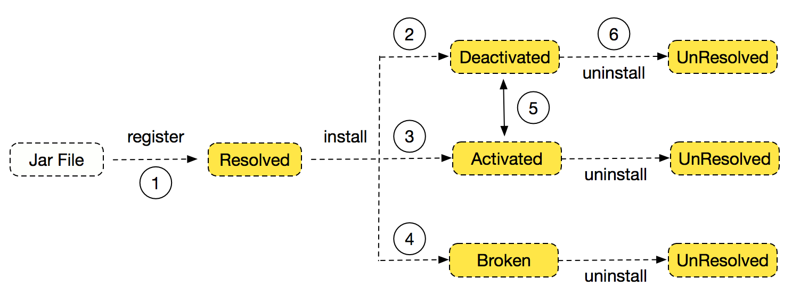

在[交互指令](./jarslink-instruction.md)一节中，描述了 Jarslink2.0 支持的指令集合，而在这一节中，则主要介绍在这些指令的背后，一个 Biz 包从静态文件到运行时被装载直至被卸载所有可能的状态迁移图。

 

上述图基本展示了一个 Biz 包的完整生命周期，下面我们逐一解释图中状态转移的方向：

+ 标号1: 执行 install 指令，Jarslink2.0 会对文件格式进行解析，如果文件格式正确，即是 Biz 包文件，将会注册该 Biz ，并执行安装步骤。

+ 标号2：安装 Biz 成功，此时 Biz 主函数被执行，Spring 上下文加载成功，健康检查通过。如果检测到有相同名称不同版本的 Biz 处于激活状态，则该 Biz 包将被设置为未激活状态。处于未激活状态的 Biz ，其发布的 JVM 服务不会被调用。

+ 标号3：安装 Biz 成功，此时 Biz 主函数被执行，Spring 上下文加载成功，健康检查通过。如果没有检测到有相同名称不同版本的 Biz 处于激活状态，则该 Biz 将被设置为激活状态，即可对外提供服务。

+ 标号4：在安装过程中出现任何异常报错或者健康检查失败，该 Biz 将被设置为 broken 状态。在安装过程中，其占有的资源将被快速释放并被注销，此时该 Biz 状态将被设置为 unresolved。

+ 标号5：Jarslink2.0 在运行时可以加载相同名称不同版本号的 Biz 包，但是最多只有一个 Biz 处于激活状态并对外提供服务。执行切换指令，两个 Biz 的状态将相互交换。

+ 标号6：执行卸载命令，Biz 将被卸载，其占有的资源以及发布的服务将被注销。