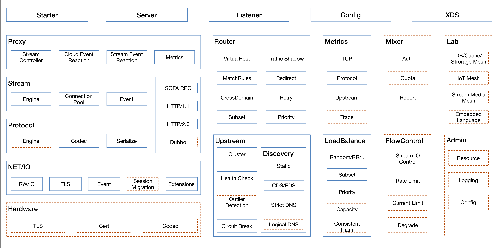
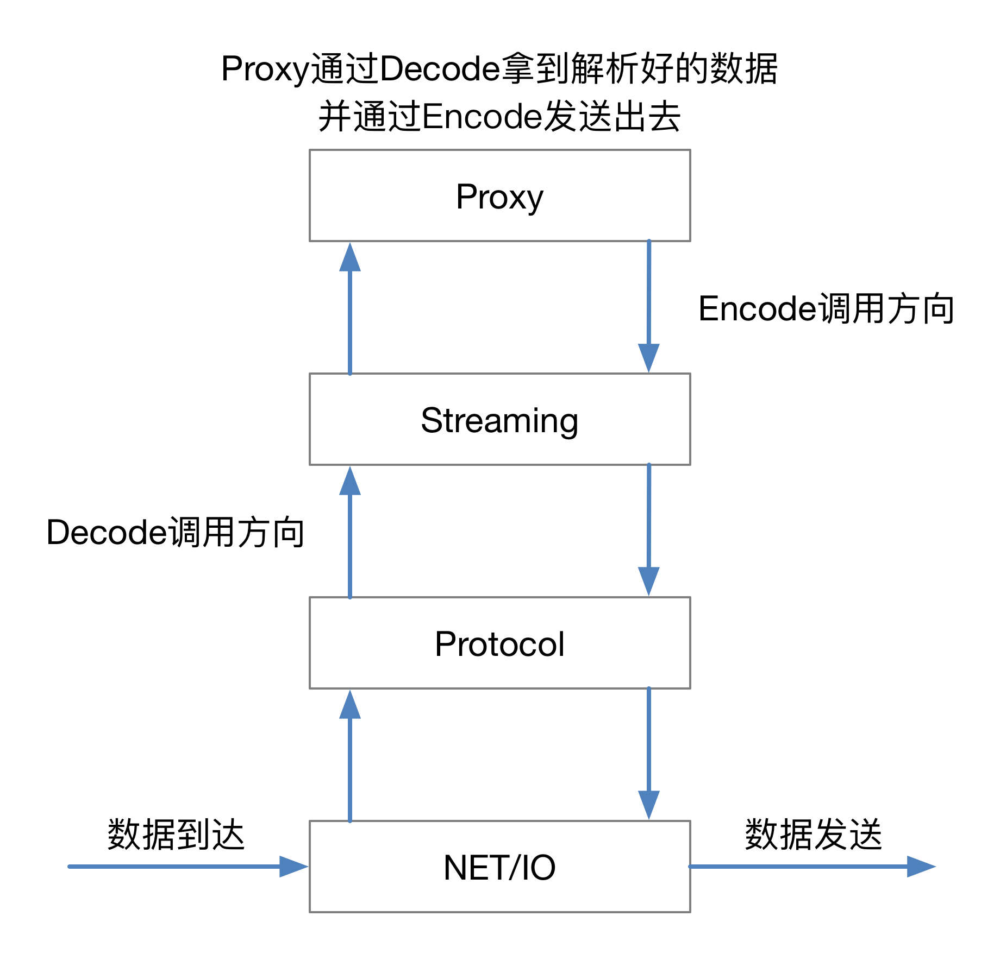

# MOSN 架构简介

MOSN 由 NET/IO、Protocol、Stream、Proxy 四个层次组成，其中

+ NET/IO 用于底层的字节流传输
+ Protocol 用于协议的 decode/encode
+ Stream 用于封装请求和响应，在一个 conn 上做连接复用
+ Proxy 做 downstream 和 upstream 之间 stream 的转发

具体请参见 [MOSN 架构](architecture.md)。

## MOSN 工作流程

下图展示的是使用 Sidecar 方式部署运行 MSON 的示意图，Service 和 MOSN 分别部署在同机部署的 Pod 上，
您可以在配置文件中设置 MOSN 的上游和下游协议，协议在 HTTP、HTTP2.0、以及SOFA RPC 中选择，未来还将支持
DUBBO, HSF 等

## MOSN 模块划分

下图展示的是组成 MOSN 的模块，

其中：

+ Starter, Server, Listener, Config, XDS 为 MOSN 启动模块，用于完成 MOSN 的运行
+ 最左侧的 Hardware, NET/IO, Protocol, Stream, Proxy 为 [MOSN 架构](architecture.md) 中介绍的 MOSN 核心模块，
  用来完成 Serive MESH 的核心功能
+ Router 为 MOSN 的核心路由模块，支持的功能包括：
    + VirtualHost 形式的路由表
    + 基于 subset 的子集群路由匹配
    + 路由重试以及重定向功能
+ Upstream 为后端管理模块，支持的功能包括：
    + Cluster 动态更新
    + Host 动态更新
    + 对 Cluster 的 主动/被动 健康检查
    + 熔断机制
    + CDS/EDS 对接能力
+ Metrics 模块可对协议层的数据做记录和追踪
+ LoadBalance 当前支持 RR, Random, Subset LB, 等负载均衡算法
+ Mixer, FlowControl, Lab, Admin 模块为待开发模块

## MOSN 内部数据流

MOSN 内部数据流如下图所示

+ NET/IO 监测连接和数据包的到来
+ Protocol 对数据包进行检测，并使用对应协议做 decode 处理
+ Streaming 对 decode 的数据包做二次封装为stream
+ Protocol 对封装的 stream 做 proxy