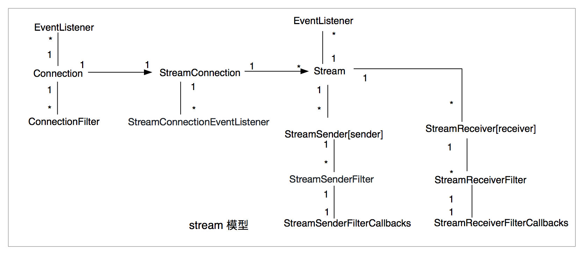

# MOSN 架构设计

在 MOSN 中，通过自底向上的 NET/IO, Protocol、Stream、Proxy 四层来构建高性能的转发系统，其中

+ Net/IO 层是用来支撑上层功能的核心层，由 `Listener` 和 `Connection` 组成。其中 istener 对端口进行监听，接收新连接。
  Connection 用来管理 listener 上 accept 的 tcp 连接，包括从 tcp conn 上读写数据等。

    + 如下为Listener和Connection的关系图:
      
      
      如图中所示，每个 Listener 上可以创建多个 Connection, 同时为了满足一些定制的功能,
      listener 和 connection 均以 filter chain 的形式提供可扩展机制, 如下所示：
      
      + Listener:
        + Event listener
            + ListenerEventListener 用于订阅 Listener 上的重要事件，包括接收连 以及关闭监听等，在对应事件发生时其中
            的函数会被调用，需要注意的是，这里的事件的执行并不会影响主流程
        + Filter
            + ListenerFilter 其中的 filter 用于定义一些钩子函数，在对应的位置触发相应的回调来与核心模型进行交互，
            它通过调用的状态码来影响主流程的执行，当前支持两个状态码，分别是 `Continue`  继续执行 以及`StopIteration` 停止当前的执行逻
      
      + Connection:
        + Event listener
            + ConnectionEventListener 在 conn 上相应事件发生时触发
        + Filter
            + ReadFilter 用于读取 conn 上到达的字节流
            + WriteFilter 用于将字节流写入到 conn 上
  

+ Protocol 层用于处理不同协议的编解码，并连接 IO 层和 Stream 层之间的逻辑，做二进制流的转化。在具体的处理中，MOSN 在收到二进制的数据后， 根据配置的下游协议选择对应的解码器，将协议decode
  成 headers, body, 以及 trailer，之后通过 stream 层的回调接口将数据上传到 stream 层进行 stream 创建，并在 proxy 层完成往 upstream 的封装后，会再次通过 stream 层调用
  protocol 的编码器将数据包编码成二进制流。

+ Stream layer 通过创建 `stream` 来实现一个连接上的多路复用，并对 stream 的 request 和 response 进行关联和处理来实现通信的高效。
  下图为 stream 和 connection 对应的关系图
   
 
 如图中所示，一个 Connection 对应一个 StreamConnection 用来管理多个 stream，在具体的实现中 StreamConnection 将 conn 上获取的数据
 分发到不同的协议的解码器上做解码，并生成具体的stream，其中 `StreamConnectionEventListener` 用来监听其上的事件，当前仅支持 "OnGoAway"
 
 而构成 stream layer 的核心数据结构 `stream` 具有如下的结构，
 同时为了满足 stream 在 encode/decode 处理过程中扩展的需要，filter chain 被引入
 
 + Stream
    + Encoder 
      + StreamSender 用来编码 request/response stream 为二进制然后发送， 'endStream' 标识符用来标志后序是否还有数据，在设置为 true 的情况下，
    无需等待直接发送 
        + StreamSenderFilter 在 stream 发送时候定义的一些钩子函数用来处理特定逻辑
        + StreamSenderFilterCallbacks
    + Decoder
      + StreamReceiver 用于处理接收到的二进制流，在 IO 接收到二进制并解码成对应的 request/response 后会被调用
        + StreamReceiverFilter 在 封装 stream 的时候定义的一些钩子函数来处理特定逻辑，例如 `故障注入`以及`心跳处理等`
        + StreamReceiverFilterCallbacks
      
    + Event listener
      + StreamEventListener 用于 stream 相关事件发生时的调用，比如 stream 被reset的时候

 + 另外，Stream 没有预先设定的方向，所以 StreamSender 可作为 client 来 encode request 也可以作为 server 来 encode response，而 StreamReceiver 
  在client 的场景下可以用来 decode response，在server的场景下可以用来 decode request

+ Proxy 是实现请求转发的核心模型，通过将 stream 在 downStream 和 upStream 之间做传递，并通过 stream id 做关联，实现
  转发。同时 Proxy 中实现了路由逻辑，以及连接池管理等逻辑，可对后端进行管理